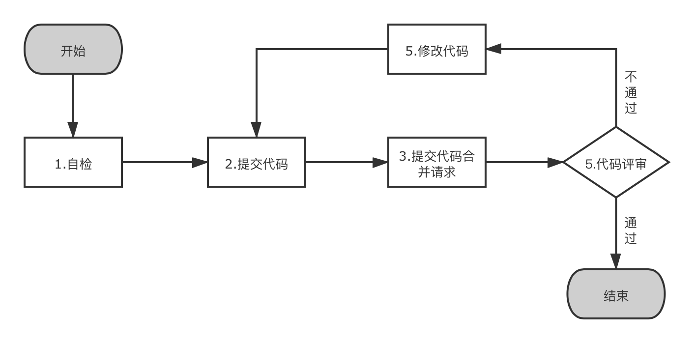
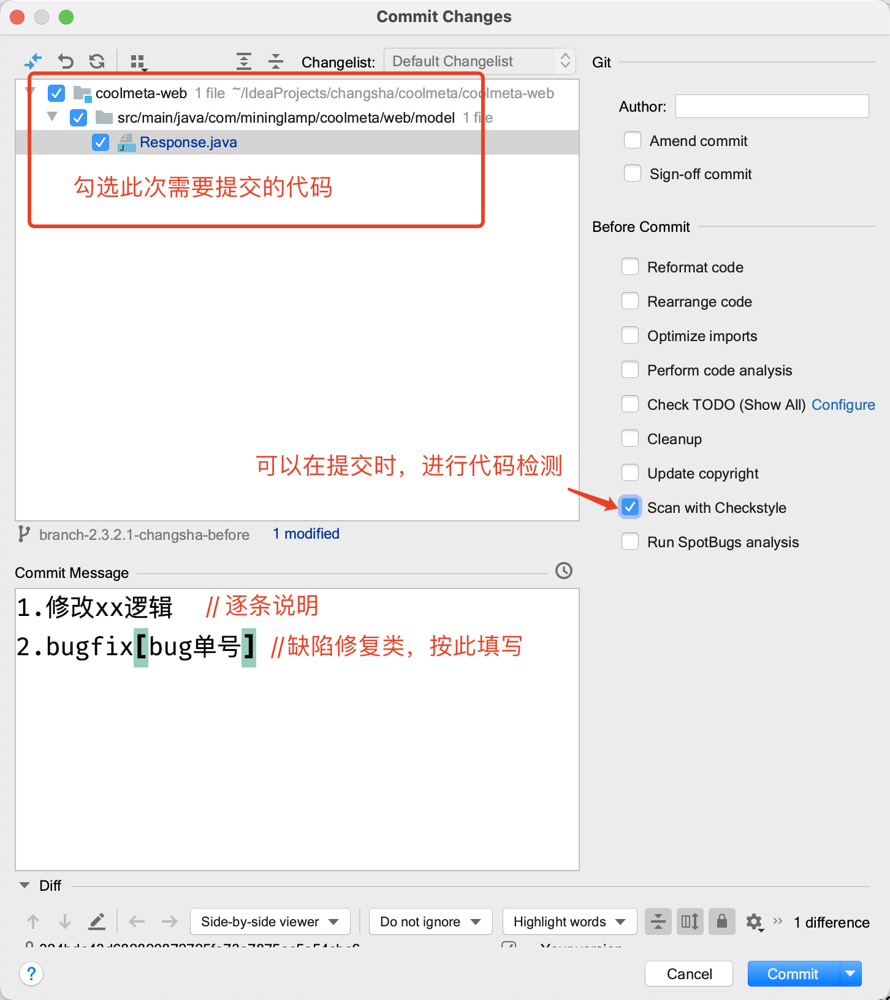
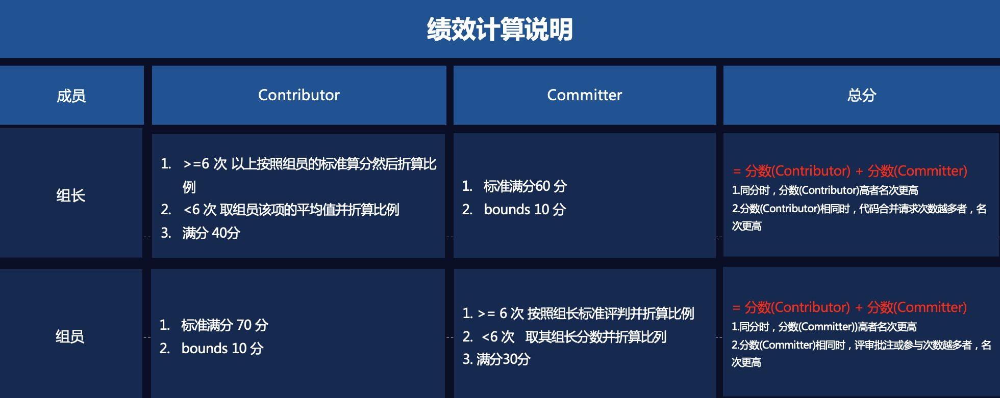

# 数据技术部-代码评审

## 1 前言

### 1.1 什么是代码评审

代码评审（Code review）是指对计算机源代码系统化地审查，常用软件同行评审的方式进行，其目的是在找出及修正在软件开发初期未发现的错误，提升软件质量及开发者的技术。代码评审常以不同的形式进行，例如结对编程、非正式的看过整个代码，或是正式的软件检查。

代码评审也称代码复查，是指通过阅读代码来检查源代码与编码标准的符合性及代码质量的活动。

### 1.2 为什么要做代码评审

- 提高代码质量

- 利于项目或功能开发早期发现明显缺陷，减少损失

- 评审过程也是重新思考的过程，可以加深对系统的理解

- 促进团队沟通，知识分享，提升整个团队的技术水平

- 好的代码评审可以保证整个工程包括团队的文化朝着好的方向发展

- 完善，系统的代码评审亦可促进团队间的交流及技术协作，有助于提升整个公司的技术水平

### 1.3 代码评审的工作原则

- 提高代码质量，符合指定的代码开发规范

- 简单、高效的完成代码评审工作

- 做到个人提升以及团队提升

- 代码评审的过程中，对于工程，不断熟悉；理解；修正；优化

- 代码评审工作优良与否，将体现在个人绩效中

### 1.4 代码评审的参与者

|  角色 | 范围 |
|  :---  | :---  |
| Committer | 小组组长/ 功能点开发负责人（多人协作或者跨组协作/技术委员会成员 |
| Contributor | 参与代码开发的人员 |

### 1.5 代码评审的范围

- 原则上，代码评审以主分支，发版分支，测试分支为主，项目分支不在评审范围内

	> 注：当项目分支的代码合并到主分支或某发版测试分支时，需进行代码评审

- 暂只对Java/Scala代码进行评审，Python,Shell 等暂不做评审

- 符合指定代码规范，以及符合指定的工程设计规范（日志、微服务、领域驱动设计等）

- 不对业务逻辑进行评审

- 不对指定代码规范以外的性能，缺陷进行评审

## 2 流程

### 2.1 自检

Contributor 在代码提交之前，需使用IDE的相关插件或构建工具的相关插件，自动检查代码是否符合指定的代码规范

> 统一使用 CheckStyle 进行代码规范的配置约束（由制定的代码规范为准）

### 2.2 提交代码

目前公司使用Gitlab进行代码托管，版本管理使用Git
- Contributor 在自检并修正之后，本地提交Commit，并按照规范填写Commit Message

  

- 原则上单个Commit的代码行数需控制在400行以内，尽量做到一个Commit一个逻辑

- 向自己的分开发支Push代码

### 2.3 提交代码合并请求

- 向需要合并的主分支提交代码合并请求（Merge Request），并通知（组群内@ 或者其他管理工具通知，并让其他组员也看见次通知）对应的Committer，及时评审代码

- 原则上一次代码合并请求的总代码行数尽量控制在400行以内

- 原则上当日代码当日提，出差项目支援等不受限制

### 2.4 代码评审

原则上只针对CheckList中的检查项进行评审

Gitlab中，支持在合并请求级别、Commit级别、文件级别以及代码行级别上作Comment，Committer应根据具体问题在相应的地方提Comment

- Committer 根据提交的代码合并请求中的每一个Commit，逐个评审

- 若存在需要修改和批注的地方，在Gitlab页面上进行批注，批注需提出修改意见或者示例，若违反了Checklist中的检查项，需明确指出检查项的编号，同时发布在组群内（或者其他通知管理工具）
	
	
	
- 原则上一次代码合并请求为一个功能逻辑，否则予以驳回

- 原则上缺陷修复、阻塞开发的代码合并请求最快速度予以处理

- 当发现提交代码与已有代码有较大变动时，应与相应的Contributor进行沟通，确保工程的正确性

- Committer 和 Contributor应是互相学习进步的关系，所以在评审的过程中，请务必持有良好的态度和给予中正的描述，对于高质量的代码应于组群内（或者其他通知管理工具）进行通报

- 当通过代码合并请求，表示一次代码评审工作完成

### 2.5  修改代码

Contributor 根据 Committer  的批注进行相应的操作

- Contributor 在收到批注之后，如果对 Committer 的批注存在异议，在Gitlab相关页面查看时，予以驳回，并附加驳回理由，并于组群内通知相应的 Committer，如果较为复杂，可以私下沟通，并将沟通结果简要的添加至批注中

- Contributor对批注无异议，并修复完成后，Commit,Push代码，在Gitlab上将批注的状态改为已解决，并通知相应的Committer

- 原则上禁止在重新提交的代码中附加新的逻辑或者不相干的任务的Commit

## 3 监督

### 3.1 日常

- 一次代码评审工作从提交到完成，原则上组员是一并参与的，共享其他成员的错误和问题、借鉴高质量的代码，并且了解其他组员的代码，有助于熟悉整体工程

- 组员可以对已经批注的代码添加自己的批注，或者提问 

- 由指定人员定时定量抽查各组长（包括功能点负责人）的代码评审情况，并予以评分

### 3.2 绩效

### 3.3 评审会

- 评审会时间不定，次数不定

- 主要做代码分享，对高质量的代码进行分享，对公共问题予以讨论

